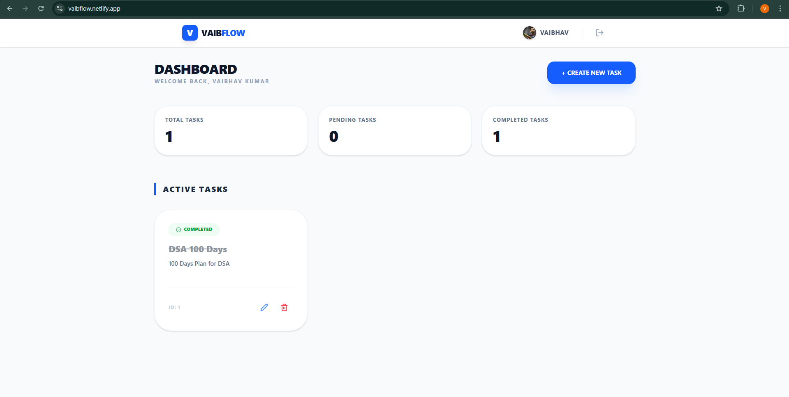
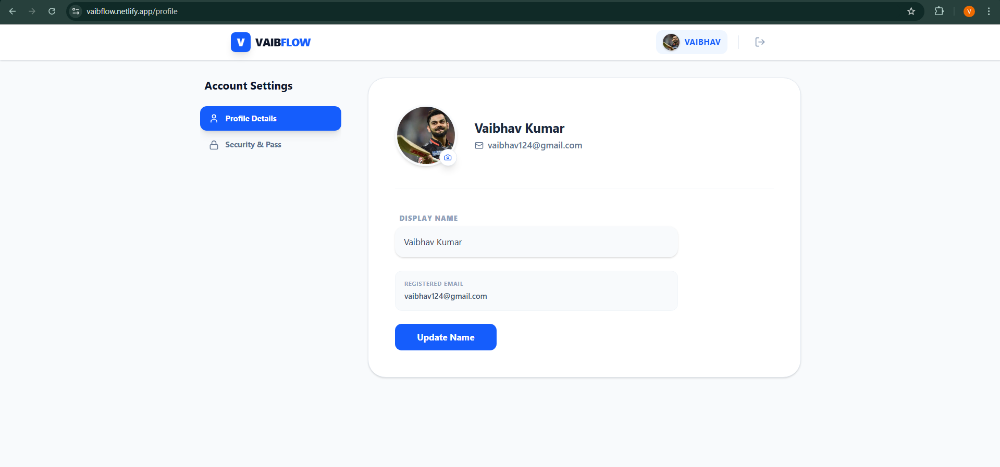
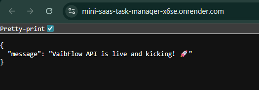

# 🚀 VaibFlow - Mini SaaS Task Manager

VaibFlow is a robust Full-Stack Task Management application designed for efficiency and a seamless user experience. This project showcases modern web development practices and a Cloud-native architecture.

**🔗 Live Deployment: [https://vaibflow.netlify.app](https://vaibflow.netlify.app)**

<p align="center">
  
  
  
  
  
  
  
</p>

---

## 🛠 Tech Stack

### Frontend

- **Library:** [React.js](https://react.dev/) (Vite)
- **Styling:** [Tailwind CSS](https://tailwindcss.com/)
- **API Management:** [Axios](https://axios-http.com/) (with Interceptors for JWT handling)
- **Routing:** [React Router DOM](https://reactrouter.com/)
- **Icons:** [Lucide React](https://lucide.dev/guide/packages/lucide-react)
- **Deployment:** [Netlify](https://www.netlify.com/)

### Backend

- **Runtime:** [Node.js](https://nodejs.org/)
- **Framework:** [Express.js](https://expressjs.com/)
- **Database:** [PostgreSQL](https://www.postgresql.org/) (Hosted on [Neon DB](https://neon.tech/))
- **ORM:** [Sequelize](https://sequelize.org/)
- **Security:** [JWT (JSON Web Tokens)](https://jwt.io/) & [Bcrypt.js](https://www.npmjs.com/package/bcryptjs)
- **Logging & Debugging:** [Morgan](https://www.npmjs.com/package/morgan) & [Nodemon](https://nodemon.io/)
- **Deployment:** [Render](https://render.com/)

---

## 📂 Project Structure

### Backend Architecture

```
Backend/
├── config/             # Database connectivity & Sequelize initialization
├── controllers/        # Logical handling of Auth and Task requests
├── middlewares/        # JWT verification & Error Handling logic
├── models/             # Database schemas (User & Task models)
├── routes/             # Express routes for API endpoints
├── .env                # Secret environment variables
├── package.json        # Dependencies & scripts
└── server.js           # Server entry point & DB sync
```

### Frontend Architecture

```
Frontend/
├── public/             # Static assets
├── src/
│   ├── api/            # Axios instance & API endpoint configurations
│   ├── components/     # Reusable UI components (Navbar, Sidebar, etc.)
│   ├── pages/          # Full page views (Login, Signup, Dashboard)
│   ├── App.jsx         # Main application logic & routing
│   └── main.jsx        # Entry point for React
├── .env                # Base URL for API
└── vite.config.js      # Vite configuration
```

---

## ⚙️ Installation & Setup

### 1. Backend Setup

```bash
# Clone the repository
git clone <your-repo-link>

# Go to Backend directory
cd Backend

# Install dependencies
npm install

# Create .env file and add your credentials
# DB_HOST, DB_USER, DB_PASSWORD, DB_NAME, JWT_SECRET

# Start development server
npm run dev
```

### 2. Frontend Setup

```bash
# Go to Frontend directory
cd Frontend

# Install dependencies
npm install

# Create .env file
# VITE_API_URL=http://localhost:5000/api

# Run the app
npm run dev
```

---

## 🌐 Deployment Details

- **Database:** The PostgreSQL database is hosted on [Neon.tech](https://neon.tech/) (Serverless Postgres).
- **Backend:** The backend service is deployed on [Render.com](https://render.com/).
- **Frontend:** The static frontend is hosted on [Netlify](https://www.netlify.com/) and is connected to the backend API.
- **CORS:** Cross-Origin Resource Sharing is configured to allow secure communication between the frontend and backend.

---

## ✨ Features

- [x] Secure User Authentication (Signup/Login)
- [x] Complete CRUD operations for Tasks
- [x] Responsive Dashboard for Mobile and Desktop
- [x] Secure Token-based Authentication (JWT)
- [x] Real-time Database Sync with `Sequelize alter: true`

---

## 📸 Showcase

Here's a glimpse of VaibFlow in action:

### Responsive Dashboard



### User Profile Management



---

## 🔗 Backend API

The backend for this project is hosted on Render. You can find the base URL below:

**API URL:** https://mini-saas-task-manager-x6se.onrender.com

Here's a snapshot of the API endpoints tested with Postman:



---

## 🚀 Future Scope

The following features are planned for future releases to enhance VaibFlow:

- [ ] **User Roles:** Implement roles like 'Admin' and 'Standard User'.
- [ ] **Task Categories:** Organize and filter tasks by categories.
- [ ] **Notification System:** Real-time notifications for task deadlines or updates.
- [ ] **Dark Mode:** A dark mode theme for the application.

---

## 🤝 Contributing

Contributions are welcome! If you have suggestions for improvements or want to report a bug, please feel free to open an issue or submit a pull request.

1.  Fork the Project
2.  Create your Feature Branch (`git checkout -b feature/AmazingFeature`)
3.  Commit your Changes (`git commit -m 'Add some AmazingFeature'`)
4.  Push to the Branch (`git push origin feature/AmazingFeature`)
5.  Open a Pull Request

---

## 📄 License

This project is licensed under the MIT License.
